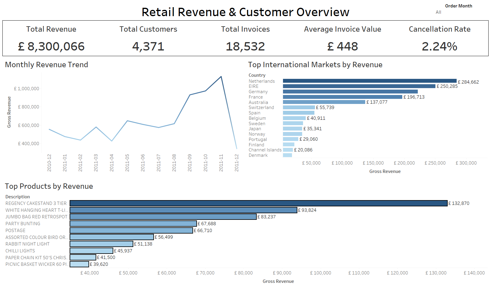
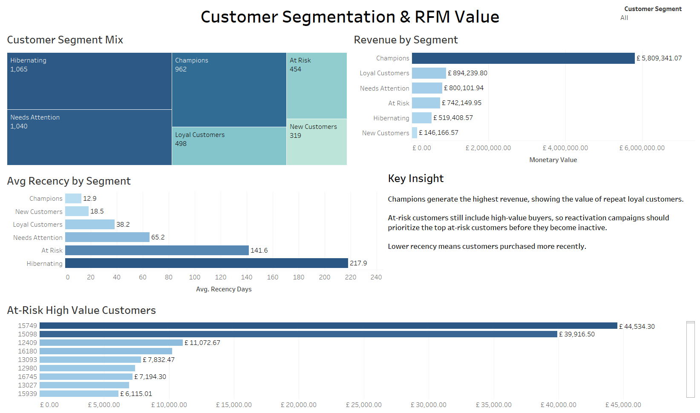
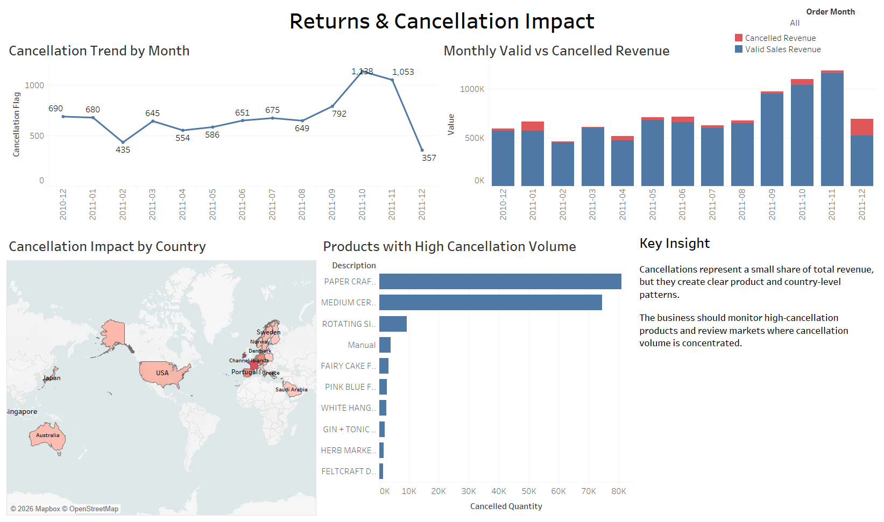

# Retail Customer Segmentation & Revenue Analytics

This project analyzes online retail transaction data to identify revenue trends, customer segments, product performance, and cancellation impact using Python, SQL, and Tableau.

The purpose is to show a complete Data Analyst workflow from raw data preparation to dashboard storytelling and business recommendations.

- Python for data cleaning and feature preparation
- SQL for KPI logic and customer segmentation
- Tableau for executive dashboarding
- Analysis notes for business findings and recommendations

## Objective

Analyze a UK-based online retail dataset to understand revenue performance, customer value groups, product and country contribution, and the business impact of cancellations.

The final output is an interactive Tableau dashboard story supported by cleaned datasets, SQL logic, calculated fields, and analysis notes.

## Tools Used

- Python
- SQL
- Tableau
- Excel/CSV

## Data Source

Dataset: Online Retail  
Source: UCI Machine Learning Repository  
URL: https://archive.ics.uci.edu/dataset/352/online+retail  
License: CC BY 4.0  
Citation: Chen, D. (2015). Online Retail [Dataset]. UCI Machine Learning Repository. https://doi.org/10.24432/C5BW33

## Business Questions

- Which countries and product categories drive the highest revenue?
- Which customers generate the most value?
- Which customers are at risk of becoming inactive?
- How can customers be segmented using RFM logic?
- How much revenue is affected by cancellations and returns?

## Key Work Done

- Cleaned raw retail transaction data and prepared Tableau-ready datasets.
- Removed invalid transactions and flagged cancellation records.
- Created revenue, invoice, customer, product, and cancellation KPIs.
- Built RFM customer segmentation using recency, frequency, and monetary value.
- Identified customer groups such as Champions, Loyal Customers, At Risk, New Customers, Needs Attention, and Hibernating.
- Created Tableau dashboards for executive revenue overview, customer segmentation, and returns/cancellation impact.
- Built a Tableau story to connect dashboard findings into final business recommendations.

## Tableau Dashboard Pages

### 1. Executive Revenue Overview

This dashboard summarizes overall business performance using KPI cards, monthly revenue trend, international market revenue, and top products by revenue.



Main views:

- Total Revenue
- Total Customers
- Total Invoices
- Average Invoice Value
- Cancellation Rate
- Monthly Revenue Trend
- Top International Markets by Revenue
- Top Products by Revenue

### 2. Customer Segmentation & RFM Value

This dashboard explains customer value using RFM segmentation. It compares segment size, revenue contribution, recency behavior, and at-risk high-value customers.



Main views:

- Customers by Segment
- Revenue by Segment
- Average Recency by Segment
- At-Risk High Value Customers

### 3. Returns & Cancellation Impact

This dashboard analyzes cancellation patterns by month, revenue impact, country, and product.



Main views:

- Cancellation Trend by Month
- Monthly Valid vs Cancelled Revenue
- Cancellation Impact by Country
- Products with High Cancellation Volume

## Business Insights

- Champions generated the highest revenue, showing the value of repeat loyal customers.
- High-value at-risk customers should be prioritized for reactivation campaigns before they become inactive.
- Revenue was concentrated in top products and selected international markets.
- Cancellations represented a small share of total revenue, but showed clear product and country-level patterns.
- Products with repeated cancellation volume should be reviewed for quality, fulfillment, listing accuracy, or customer expectation issues.

## Business Recommendations

- Protect Champions and Loyal Customers with retention campaigns.
- Prioritize high-value At Risk customers for reactivation.
- Monitor products with repeated cancellation volume.
- Review countries with concentrated cancellation impact.
- Continue tracking monthly revenue and cancellation trends to identify changes in performance early.

## Project Outputs

```text
data/raw/online_retail.xlsx
data/processed/online_retail_clean.csv
data/processed/customer_rfm_segments.csv
data/processed/monthly_revenue_summary.csv
sql/retail_kpi_queries.sql
tableau/calculated_fields.md
tableau/dashboard_blueprint.md
analysis/executive_summary.md
analysis/customer_segmentation_dashboard.md
analysis/returns_cancellation_dashboard.md
images/executive_revenue_overview.png
images/customer_segmentation_rfm.png
images/returns_cancellation_impact.png
Dashboard.twb
```

## Portfolio Positioning

This project should be presented as a Tableau dashboard story supported by Python and SQL. It demonstrates data cleaning, KPI design, customer segmentation, cancellation analysis, dashboard development, and business recommendation writing.
